# Second-Order Memristor Circuit Emulator & Hopfield Neural Network Dynamics

[](https://doi.org/10.1109/TCSI.2026.3663432)
[](https://www.analog.com/en/resources/design-tools-and-calculators/ltspice-simulator.html)
[](https://www.mathworks.com/products/matlab.html)
[](LICENSE)
[]()

A complete hardware circuit emulator (LTspice) and numerical simulation suite (MATLAB) for the **Second-Order Memristor (SOM)** and its application to **Memristive Hopfield Neural Networks (SOM-HNN)**, reproducing the findings of the 2026 IEEE TCAS-I paper:

> **Primary Reference:**  
> Hairong Lin, Xiaoheng Deng, Yi Zhang, and Geyong Min, *"A Second-Order Memristor Method to Construct Memristive Neural Networks With Multi-Butterfly and Multi-Scroll Dynamics,"* in **IEEE Transactions on Circuits and Systems I: Regular Papers**, 2026.  
> **DOI:** [10.1109/TCSI.2026.3663432](https://doi.org/10.1109/TCSI.2026.3663432)

---

## 📖 Table of Contents
1. [Overview & Highlights](#-overview--highlights)
2. [Mathematical Model](#-mathematical-model)
   - [Second-Order Memristor Formulation](#second-order-memristor-formulation)
   - [Multi-Piecewise Function $h(\phi_2)$](#multi-piecewise-function-hphi_2)
3. [Analog Circuit Implementation (LTspice)](#-analog-circuit-implementation-ltspice)
   - [Circuit Architecture & Schematic](#circuit-architecture--schematic)
   - [Hardware Component Dimensioning](#hardware-component-dimensioning)
   - [Macro-Model Stability (`UniversalOpAmp1.lib`)](#macro-model-stability-universalopamp1lib)
4. [Hardware Emulation Results](#-hardware-emulation-results)
   - [Pinched Hysteresis Loops (Amplitude Sweep)](#pinched-hysteresis-loops-amplitude-sweep)
   - [Pinched Hysteresis Loops (Frequency Sweep)](#pinched-hysteresis-loops-frequency-sweep)
5. [Numerical Dynamics & Verification (MATLAB)](#-numerical-dynamics--verification-matlab)
6. [Application: Memristive Hopfield Neural Network (SOM-HNN)](#-application-memristive-hopfield-neural-network-som-hnn)
   - [Neural Network Coupling Architecture](#neural-network-coupling-architecture)
   - [5D Dynamic Equations](#5d-dynamic-equations)
   - [Multi-Butterfly Chaotic Attractor](#multi-butterfly-chaotic-attractor)
7. [Repository Structure](#-repository-structure)
8. [Getting Started & Quick Run](#-getting-started--quick-run)
   - [Running LTspice Emulation](#running-ltspice-emulation)
   - [Running MATLAB Simulations](#running-matlab-simulations)
9. [Citation](#-citation)
10. [License](#-license)

---

## 🌟 Overview & Highlights

Memristors are nonlinear passive two-terminal electronic devices that link electric charge and magnetic flux. While first-order memristors possess a single internal state variable, higher complexity dynamics and non-volatile memory effects are observed in **second-order memristors (SOM)** with dual state variables.

This repository provides:
- **LTspice Circuit Schematic (`second_order_memregister.asc`)**: A fully realized analog equivalent circuit utilizing off-the-shelf op-amps, analog multipliers, and passive $RC$ networks to emulate the dual-state equations without convergence bottlenecks.
- **Custom Robust Op-Amp Model (`UniversalOpAmp1.lib`)**: Features smooth hyperbolic saturation ($\pm 13.5\text{ V}$) to prevent Newton-Raphson iteration singular matrices in SPICE transient analyses.
- **Pinched Hysteresis Verification**: Replicates both amplitude-dependent and frequency-dependent fingerprint characteristics of memristors across $5\text{ kHz}$ to $80\text{ kHz}$.
- **Hopfield Neural Network (SOM-HNN) Integration**: Implementation of the 5D memristively coupled Hopfield neural network exhibiting multi-butterfly chaotic attractors ($M=2, 4\text{-butterfly}$).

---

## 📐 Mathematical Model

### Second-Order Memristor Formulation
The voltage-controlled second-order memristor model is described by its terminal current-voltage relationship:

$$i = W(\phi_1, \phi_2) v = (\alpha - \beta \phi_1 - \gamma \phi_2) v$$

where $v$ is the terminal voltage, $i$ is the terminal current, $W(\phi_1, \phi_2)$ represents the memductance, and $\phi_1, \phi_2$ are the two internal state variables governing the memristor's memory dynamics:

$$\begin{cases}
\dot{\phi}_1 = a - b v^2 - c \phi_1 \\
\dot{\phi}_2 = p v - q h(\phi_2)
\end{cases}$$

### Multi-Piecewise Function $h(\phi_2)$
To induce multi-scroll / multi-butterfly attractor dynamics, the nonlinear function $h(\phi_2)$ is defined as a multi-piecewise linear saturation function parametrized by an integer $M$:

$$h(\phi_2) = \begin{cases}
\phi_2, & M < 0 \\
\phi_2 + M - \sum_{i=0}^M \text{sgn}(\phi_2 + 2i), & M = 0, 1, 2, \dots
\end{cases}$$

For $M = 3$ (as used in the hardware emulator), the switching thresholds are located at $0\text{ V}, -2\text{ V}, -4\text{ V},$ and $-6\text{ V}$.

| Parameter | Description | Value |
| :---: | :--- | :---: |
| $\alpha$ | Linear conductance offset | $1.0$ |
| $\beta$ | Weight of first internal state $\phi_1$ | $1.0$ |
| $\gamma$ | Weight of second internal state $\phi_2$ | $0.01$ |
| $a$ | Constant bias rate of $\phi_1$ | $1.0$ |
| $b$ | Nonlinear square-voltage coefficient | $1.0$ |
| $c$ | Dissipation / relaxation rate of $\phi_1$ | $0.1$ |
| $p$ | Coupling strength of voltage $v$ onto $\phi_2$ | $2.2$ |
| $q$ | Nonlinear feedback coefficient | $5.0$ |
| $M$ | Piecewise index parameter | $3$ (Circuit) / $2$ (4-Butterfly HNN) |

---

## ⚡ Analog Circuit Implementation (LTspice)

### Circuit Architecture & Schematic
The circuit maps the mathematical model into analog hardware using standard operational amplifiers and four-quadrant multipliers:
1. **$\phi_1$ Inverting Integrator & Inverter ($U_{13}, U_{15}$)**: Implements $\dot{\phi}_1 = a - b v^2 - c \phi_1$. An analog multiplier ($B_1$) computes $v^2/10$.
2. **$\phi_2$ Inverting Integrator & Inverter ($U_{14}, U_{16}$)**: Implements $\dot{\phi}_2 = p v - q h(\phi_2)$.
3. **4-Stage Comparator & Summing Network ($U_1 - U_5$)**: Implements the multi-piecewise function $h(\phi_2)$ with threshold bias voltages $V_1 = 0\text{ V}, V_2 = -2\text{ V}, V_3 = -4\text{ V}, V_7 = -6\text{ V}$.
4. **Memductance & Terminal Multipliers ($U_{17}, B_2, B_3$)**: Computes $W = \alpha - \beta \phi_1 - \gamma \phi_2$ and outputs current $i = W v$.

<p align="center">
  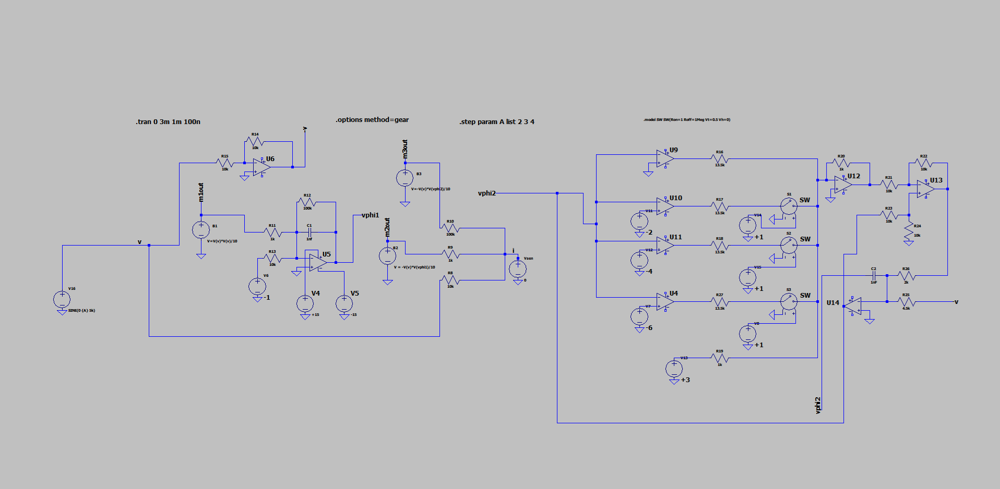
  <br>
  <em>Figure 1: Full schematic of the Second-Order Memristor Circuit Emulator (corresponding to Fig. 3 in the paper).</em>
</p>

### Hardware Component Dimensioning
Normalized integration time constant: $\tau_0 = R_0 C_0 = 10\text{ k}\Omega \times 1\text{ nF} = 10\,\mu\text{s}$.

$$\begin{aligned}
&R_0 = 10\text{ k}\Omega, \quad C_1 = C_2 = 1\text{ nF} \\
&R_9 = \frac{R_0}{a} = 10\text{ k}\Omega, \quad R_{10} = \frac{R_0}{10 b} = 1\text{ k}\Omega, \quad R_{11} = \frac{R_0}{c} = 100\text{ k}\Omega \\
&R_{12} = \frac{R_0}{p} \approx 4.545\text{ k}\Omega, \quad R_{13} = \frac{R_0}{q} = 2\text{ k}\Omega, \quad R_{16} = 13.5\text{ k}\Omega
\end{aligned}$$

### Macro-Model Stability (`UniversalOpAmp1.lib`)
Standard library op-amps often cause Direct Newton-Raphson convergence failure when switching across rail limits in chaotic or piecewise circuits. This repository includes a high-performance macromodel clamped at $\pm 13.5\text{ V}$:
```spice
* UniversalOpAmp1 - High Convergence Macro-Model
.subckt UniversalOpAmp1 in+ in- out
B1 out 0 V=table(1e5*(V(in+)-V(in-)), -13.5,-13.5, 13.5,13.5)
Rin in+ in- 10Meg
Rout out 0 10
.ends UniversalOpAmp1
```

---

## 📊 Hardware Emulation Results

Simulated in LTspice with transient step `0.01u` to `0.05u` across both amplitude and frequency variations, matching Fig. 4 of Lin et al.:

### Pinched Hysteresis Loops (Amplitude Sweep)
At constant frequency $f = 5\text{ kHz}$, the amplitude of the excitation voltage $v(t) = A \sin(2\pi f t)$ is varied across $A = 2\text{ V}, 3\text{ V}, 4\text{ V}$:

<p align="center">
  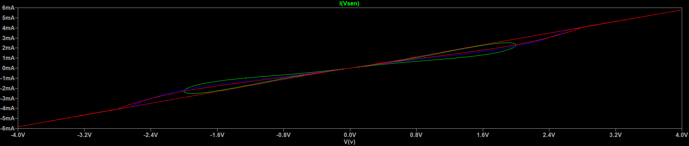
  <br>
  <em>Figure 2: Pinched hysteresis loops in the $v - i$ plane under amplitude modulation ($A = 2\text{ V}, 3\text{ V}, 4\text{ V}$ at $5\text{ kHz}$). The lobe area expands with larger excitation amplitude.</em>
</p>

### Pinched Hysteresis Loops (Frequency Sweep)
At constant amplitude $A = 2\text{ V}$, the frequency is swept across $f = 5\text{ kHz}, 20\text{ kHz}, 80\text{ kHz}$:

<p align="center">
  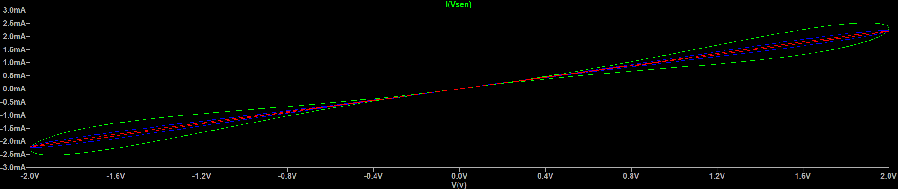
  <br>
  <em>Figure 3: Pinched hysteresis loops under frequency modulation ($f = 5\text{ kHz}, 20\text{ kHz}, 80\text{ kHz}$ at $A = 2\text{ V}$). As frequency increases toward infinity, the hysteresis area progressively shrinks to a single-valued function.</em>
</p>

---

## 🔬 Numerical Dynamics & Verification (MATLAB)

The numerical integration of Eq. (3) & (4) using `ode23` produces identical dynamic portraits:

| Dynamic Behavior | Phase Portrait / Time Series |
| :--- | :--- |
| **State Time Series** ($v, \phi_1, \phi_2, W$) | 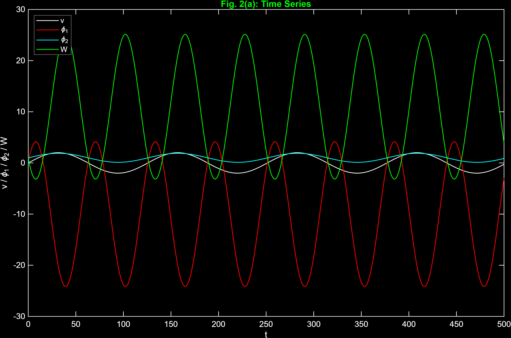 |
| **State Variables vs Voltage** ($\phi_1, \phi_2, W \text{ vs } v$) | 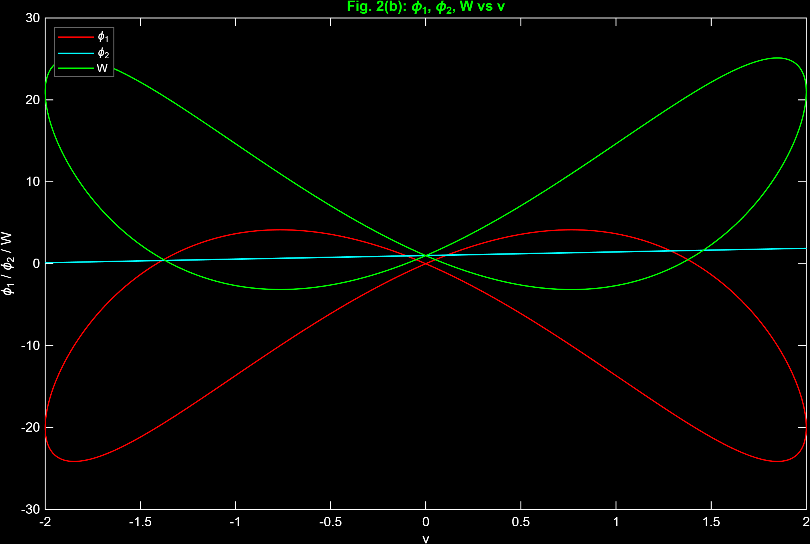 |
| **Pinched Hysteresis: Amplitude Sweep** | 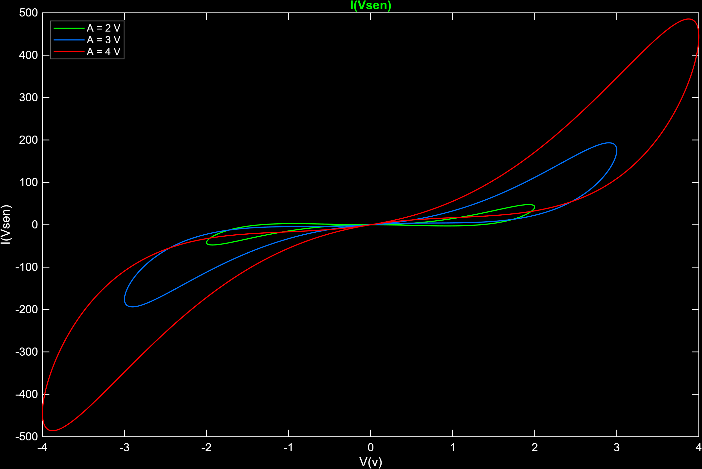 |
| **Pinched Hysteresis: Frequency Sweep** | 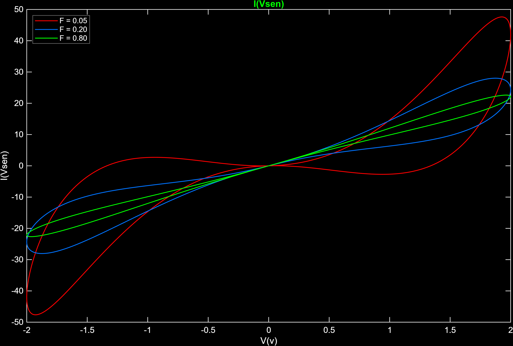 |

---

## 🧠 Application: Memristive Hopfield Neural Network (SOM-HNN)

### Neural Network Coupling Architecture
In the paper, the second-order memristor is introduced as an electromagnetic radiation coupling channel between **Neuron 2** and **Neuron 3** in a 3-neuron Hopfield Neural Network:

<p align="center">
  
  <br>
  <em>Figure 4: Connection structure of the Hopfield Neural Network incorporating magnetic induction coupling via the Second-Order Memristor (Fig. 5 in paper).</em>
</p>

### 5D Dynamic Equations
The 5-dimensional differential system describing the SOM-HNN is given by:

$$\begin{cases}
\dot{x}_1 = -x_1 + 0.4\tanh(x_2) - 4.0\tanh(x_3) \\
\dot{x}_2 = -x_2 - 0.23\tanh(x_1) - 0.3\tanh(x_2) - k W(\phi_1, \phi_2)(x_2 - x_3) \\
\dot{x}_3 = -x_3 - 4.5\tanh(x_2) + k W(\phi_1, \phi_2)(x_2 - x_3) \\
\dot{\phi}_1 = a - b (x_2 - x_3)^2 - c \phi_1 \\
\dot{\phi}_2 = p (x_2 - x_3) - q h(\phi_2)
\end{cases}$$

where $k$ is the memristive coupling strength and $(x_2 - x_3)$ is the differential membrane potential inducing the magnetic flux.

### Multi-Butterfly Chaotic Attractor
With $k = 0.4$ and $M = 2$, the system produces a remarkable **4-butterfly chaotic attractor**:

| 4-Butterfly Attractor ($\phi_2 - \phi_1$ Plane) | 3D State-Space Trajectory ($x_1 - x_2 - x_3$) |
| :---: | :---: |
| 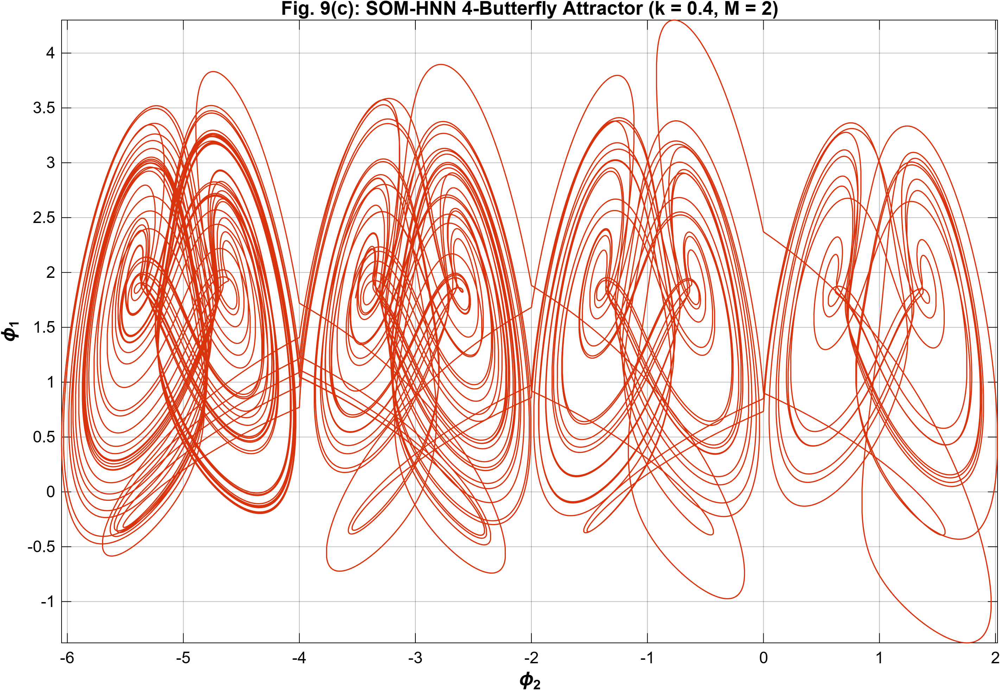 | 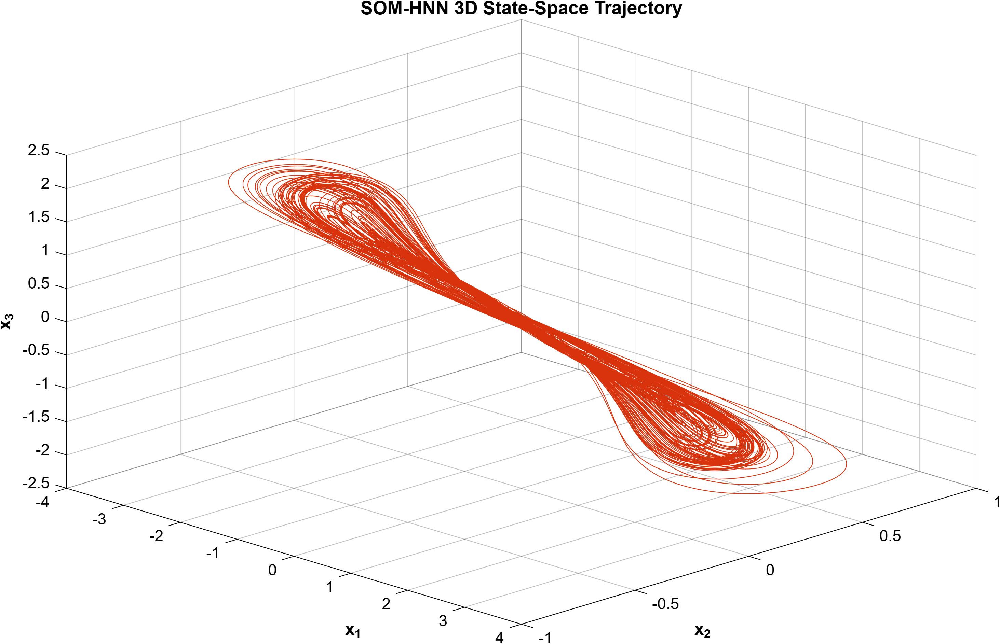 |

| State Variables vs Time | Transient vs Steady State Comparison |
| :---: | :---: |
| 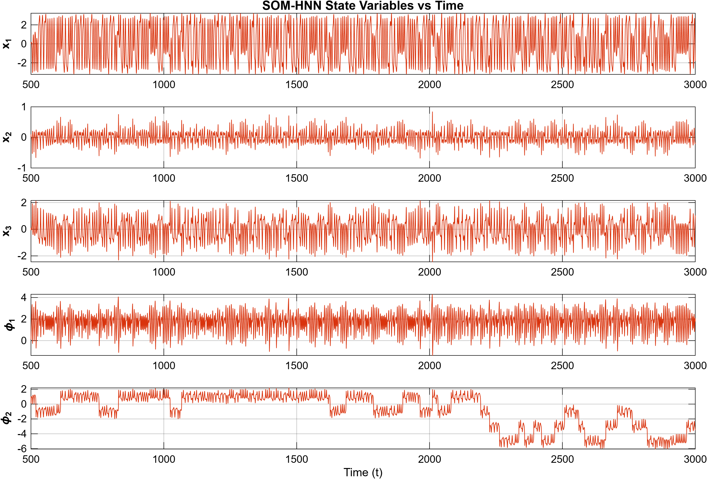 | 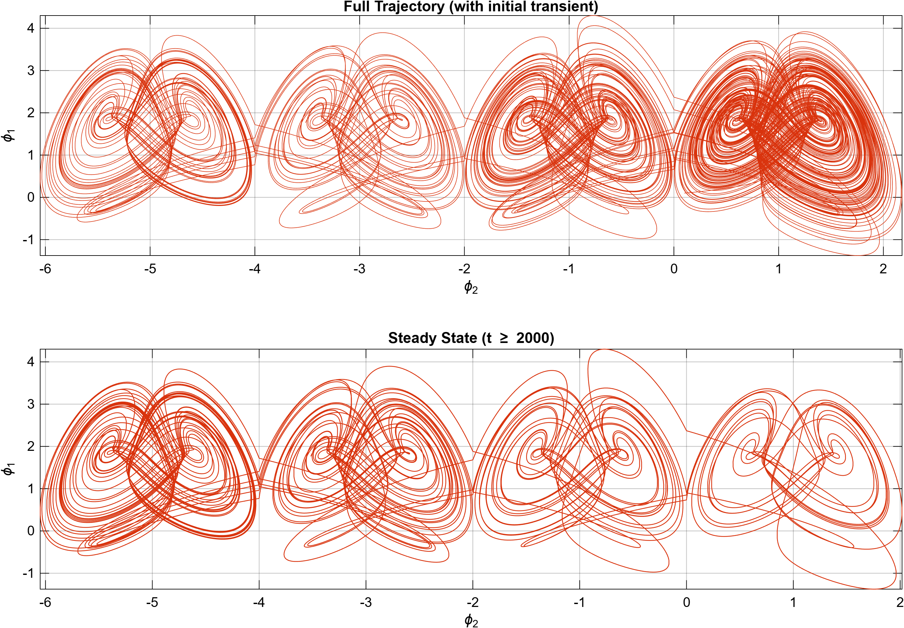 |

---

## 📂 Repository Structure

```plaintext
Second-Order-Memristor-Emulator/
├── .gitignore                                           # Ignores SPICE dumps (*.raw, *.log) & large binaries
├── UniversalOpAmp1.lib                                  # High-stability op-amp subcircuit for LTspice
├── second_order_memregister.asc                         # Complete LTspice circuit schematic
├── figures/                                             # High-resolution simulation & architecture figures
│   ├── second_order_mem_regestier.png                   # Circuit emulator schematic
│   ├── 4a.png                                           # LTspice Fig. 4(a) amplitude sweep
│   ├── 4b.png                                           # LTspice Fig. 4(b) frequency sweep
│   ├── Fig2a_Time_Series.png                            # MATLAB Fig. 2(a) time series
│   ├── Fig2b_State_vs_v.png                             # MATLAB Fig. 2(b) state vs v
│   ├── Fig2c_Pinched_Hysteresis_Amplitude.png           # MATLAB Fig. 2(c) amplitude sweep
│   ├── Fig2d_Pinched_Hysteresis_Frequency.png           # MATLAB Fig. 2(d) frequency sweep
│   ├── Connection_structure_of_the Neural network...png # HNN magnetic coupling diagram
│   ├── SOM_HNN_4Butterfly_Attractor.png                 # Fig. 9(c) 4-butterfly phase portrait
│   ├── SOM_HNN_3D_State_Space.png                       # 3D attractor in x1-x2-x3 space
│   ├── SOM_HNN_State_Variables.png                      # Time evolution of 5 state variables
│   └── SOM_HNN_Transient_vs_Steady.png                  # Transient vs steady-state trajectory
├── matlab/                                              # MATLAB simulation scripts
│   ├── run_memristor_hysteresis.m                       # Replicates Fig. 2 hysteresis & state dynamics
│   ├── run_4butterfly.m                                 # Replicates Fig. 9(c) 4-butterfly attractor
│   └── som_hnn.m                                        # 5D SOM-HNN ODE function (Eq. 19)
└── README.md                                            # Repository documentation
```

---

## 🚀 Getting Started & Quick Run

### Running LTspice Emulation
1. **Prerequisites**: Install [LTspice](https://www.analog.com/en/resources/design-tools-and-calculators/ltspice-simulator.html) (Version XVII or 24).
2. **Clone the repository**:
   ```bash
   git clone https://github.com/Mukesh-Yadav-4/second-order-memristor-emulator.git
   cd second-order-memristor-emulator
   ```
3. Open `second_order_memregister.asc` in LTspice.
4. **Reproduce Fig. 4(a) (Amplitude Sweep)**:
   - Ensure the SPICE directive `.step param A list 2 3 4` is active.
   - Click **Run** (`Alt + R`).
   - In the plot pane, right-click the horizontal axis $\to$ change quantity from `time` to `V(v)`.
   - Right-click $\to$ **Add Trace** $\to$ select `I(R1)` or `-I(R1)` (the memristor terminal current).
5. **Reproduce Fig. 4(b) (Frequency Sweep)**:
   - Set amplitude $A = 2$, activate `.step param freq list 5k 20k 80k`, and set source frequency to `{freq}`.
   - Re-run and observe the pinched hysteresis collapse.

### Running MATLAB Simulations
1. Open MATLAB and navigate to the `matlab/` directory:
   ```matlab
   cd('matlab');
   ```
2. **Memristor Hysteresis (Fig. 2)**:
   ```matlab
   run_memristor_hysteresis
   ```
   *Displays all 4 figures (Time series, state variables vs voltage, amplitude sweep, and frequency sweep) in a high-contrast tabbed window and automatically exports high-res PNGs to `../figures/`.*
3. **4-Butterfly Chaotic Dynamics (Fig. 9c)**:
   ```matlab
   run_4butterfly
   ```
   *Integrates the 5D SOM-HNN system from $t = 500$ to $t = 3000$ and plots the 3D state space, 4-butterfly phase portrait, state variables, and transient-steady state comparisons.*

---

## 📚 Citation

If you use this circuit model, simulation code, or data in your research or academic publications, please cite the original authors:

```bibtex
@article{lin2026second,
  title={A Second-Order Memristor Method to Construct Memristive Neural Networks With Multi-Butterfly and Multi-Scroll Dynamics},
  author={Lin, Hairong and Deng, Xiaoheng and Zhang, Yi and Min, Geyong},
  journal={IEEE Transactions on Circuits and Systems I: Regular Papers},
  year={2026},
  doi={10.1109/TCSI.2026.3663432},
  publisher={IEEE}
}
```

---

## 📜 License
This project is open-source under the [MIT License](LICENSE) © 2026 Mukesh Yadav.

> **Note on Intellectual Property:** The MIT License applies to the implementation code, circuit schematics, macro-models, and simulation scripts developed in this repository. All rights to the underlying theoretical model, original research paper, and publication content belong to the original authors (*Hairong Lin, Xiaoheng Deng, Yi Zhang, and Geyong Min*) and the **IEEE**.
